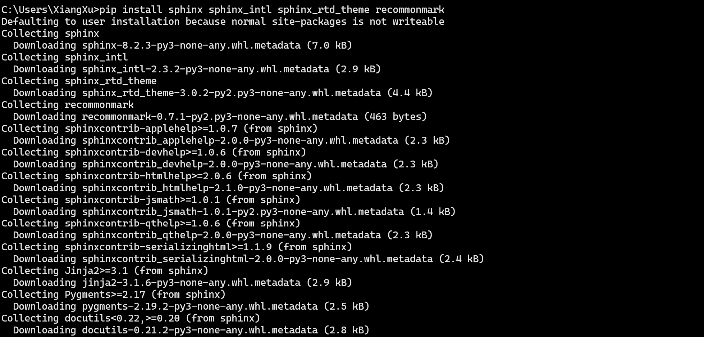
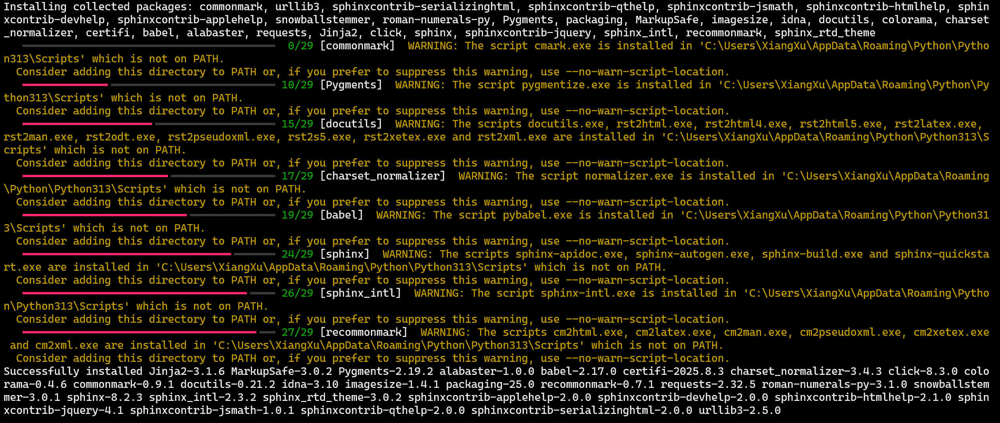
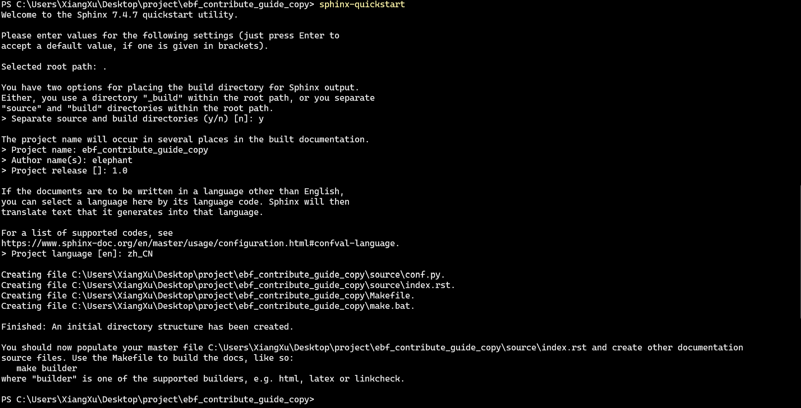
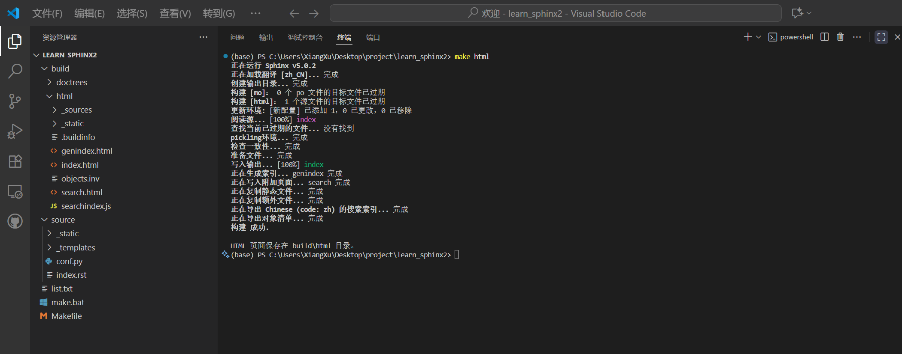
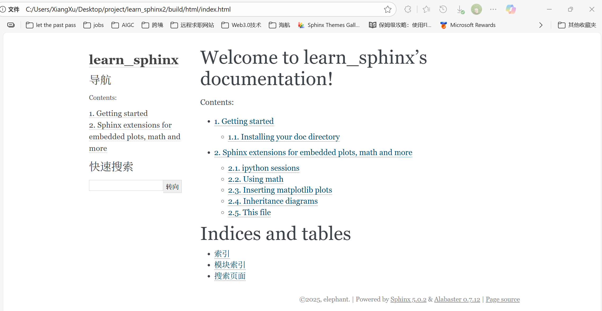

最近在研究Sphinx和RST文件相关的东西。✍✍✍

<!-- more -->


## 1. Sphinx和reStructureText 初识

### 1.1 何为reStructuredText

reStructuredText（通常简称为 RST、ReST 或 reST）是一种**轻量级标记语言**，主要在 **Python 编程语言社区**中广泛用于技术文档的编写。`.rst`文件是reStructuredText的文件扩展名。

**reStructuredText 的主要特点和用途：**

- **纯文本格式**：`.rst` 文件是纯文本文件，这意味着你可以使用任何文本编辑器打开和编辑它们。它们的语法设计目标是让即使不经过解析，原始的纯文本内容也具有良好的可读性，类似于 Markdown。
- **技术文档**：RST 最主要的用途是编写技术文档，特别是 Python 项目的官方文档。例如，Python 官方文档、许多 Python 库（如 [NumPy](https://zhida.zhihu.com/search?content_id=258376996&content_type=Article&match_order=1&q=NumPy&zhida_source=entity), [SciPy](https://zhida.zhihu.com/search?content_id=258376996&content_type=Article&match_order=1&q=SciPy&zhida_source=entity), [Django](https://zhida.zhihu.com/search?content_id=258376996&content_type=Article&match_order=1&q=Django&zhida_source=entity) 等）的文档都是用 RST 编写的。

- **易于学习和编写**：相比于更复杂的标记语言（如 HTML 或 LaTeX），RST 的语法更简洁、直观，易于学习和编写。它使用简单的符号和约定来表示标题、列表、代码块、链接、表格等结构。

- **可扩展性强**：RST 提供了强大的 "role" (角色) 和 "directive" (指令) 机制，允许用户和工具开发者创建自定义的标记和功能，从而极大地增强了表达能力和灵活性。这使得它在处理复杂的技术文档时比 Markdown 更有优势。

- **统一的解析**：无论在哪个平台，RST 的解析功能都统一在 Docutils 模块下，这有助于保证文档的一致性和可移植性，避免了像某些 Markdown 实现那样因扩展标准不统一而导致的兼容性问题。

> Docutils 是一个 Python 库，用于将纯文本文件（包括 RST 格式）解析并转换为各种输出格式，如 HTML、LaTeX、XML 等。


### 1.2 何为Sphinx

自 2008 年以来，RST 一直是 **Sphinx 文档生成系统**的核心组件。Sphinx 是一个强大的文档工具，广泛用于生成高质量的、可索引的、包含交叉引用的技术文档网站和 PDF 手册。如果你看到一个用 Sphinx 构建的文档网站，那么它的源文件很可能就是 `.rst` 文件。


## 2. 安装Sphinx

Sphinx 是一个更高级的文档生成系统，它建立在 Docutils 之上，并提供了丰富的功能，如多文件支持、交叉引用、搜索功能、多种主题、扩展插件等。它是 Python 项目文档的事实标准。

cmd中输入命令：

```cmd
pip install sphinx sphinx_intl sphinx_rtd_theme recommonmark
```



安装成功




## 3. sphinx-quickstart

Sphinx提供了一个快速创建Sphinx项目的脚本`sphinx-quickstart`，这个脚本相当于一个设置向导，通过询问一系列问题，根据我们的回答生成项目的文档源目录及默认配置文件，如下图所示：

```powershell
sphinx-quickstart
```



> 提示：所有的项目配置均可以在之后通过项目配置文件 _conf.py_ 修改


完成上述步骤后，当前路径下会出现如下文件夹：

```yaml
├─ make.bat		# Windows下的编译脚本
├─ Makefile		# Linux下的编译文件
├─ build		# make编译后产生的导出文件目录
└─ source		# 文档源码目录
    ├─ conf.py		# 项目配置文件
    ├─ index.rst	# 文档源文件入口
    ├─ _static		# 用于存放参与编译的静态文件
    └─ _templates	# 用于存放项目的主题模板文件
```


终端输入以实时预览：

bash cmd中写法

```cmd
while true; do sphinx-build -b html . _build; sleep 2; done
```

powershell中写法

```powershell
while ($true) { sphinx-build -b html . _build; Start-Sleep -Seconds 2 }
```


我们已经成功创建一个Sphinx项目，可以对项目进行添加和装饰啦！

> 注意：
>
> - Powershell（Windows下VS Code的默认终端）需使用`.\make html`，`.\`不可省略
> - `.\make html`会对index.rst及其关联文件进行编译并在`../build/html`目录下生成HTML项目包



使用浏览器打开`../learn-sphinx/build/html`目录下的index.html文件，可以看到一个Sphinx生成的简单网页：


尽管我们还没有向文档源文件中填充具体内容，但是其已经向我们展示了Sphinx生成网页的基本结构：

左侧为项目名称，具有导航页和搜索框，主体上方有欢迎语，下方是项目创建时间，文档创建说明和页面源文件链接。


## 4. 组织内容 

### 修改index.rst文件

Sphinx使用RST作为默认标记语言，通常可以在source目录下添加chapter1.rst，chapter2.rst等源文件来撰写文档的不同章节，并使用index.rst对其他rst文件进行组织管理。

> 提示：
>
> - index.rst是Sphinx的文档主入口，它被转换为文档的欢迎页
> - 建议source目录下新建一个images目录存放文档中需要插入的图片

我从[github learn_sphinx][https://github.com/dac-tutorial/dac-tutorial/blob/master/learn-sphin-theme-modified]上下载rst文件放入source目录，完成后的目录结构如下：

```yaml
├─ make.bat
├─ Makefile 
├─ build        
└─ source
    ├─ Chapter1.rst
    ├─ Chapter2.rst
    ├─ conf.py
    ├─ index.rst
    ├─ images
    │      basic_screenshot.png
    ├─ _static
    └─ _templates
```

添加完rst文件之后，还需要在index.rst中将这些文件包含进来，并定义文档结构。我们需要使用VS Code对index.rst中的toctree做如下修改：

```yaml
.. toctree::
   :maxdepth: 2
   :caption: Contents:
   :numbered:

   Chapter1
   Chapter2
```

toctree用来产生目录表，numbered表示章节编号，maxdepth表示目录中显示几层标题，之后空一行，下面列出rst文件，可以不加后缀，但是要注意代码对齐。修改完成后，在make html并在浏览器中打开，如下图：




## 5. 修改配置 

### 修改conf.py文件

我们通过sphinx-quickstart脚本自动创建的cong.py文件已经包含项目的一些基本属性和配置。我们可以通过修改conf.py内容来修改sphinx项目配置。

主要包括项目信息，一般配置项，及HTML输出选项。

### 5.1  项目信息

项目信息包括项目名称project，版权声明copyright，作者姓名author，以及项目版本release等。

> 注意： 
>
> release实际是指项目的完整版本，除了项目的主要版本version外，还包括alpha/beta/rc等标签。项目主要版本version也可以单独作为一条属性放在conf.py中。


### 5.2  一般配置项 

一般配置项内容丰富，我们只介绍最常用的几个：

- extensions：配置Sphinx的扩展。

- source_suffix：定义源文件的文件扩展名，值可以为字典映射文件扩展名到文件类型，默认为

  `source_suffix = {'.rst': 'restructuredtext'}`

- language：文档编写的语言代码。英文是`en`，中文是`zh_CN`

  

**eg1: 为Sphinx项目添加Markdown支持**

> Markdown也是一种标记性语言
>
> Sphinx默认仅支持reStructuredText语言，但是可以我们可以通过安装recommonmark源解析器扩展使其支持添加Markdown语言

安装recommonmark

```powershell
conda install recommonmark
```

修改conf.py文件


这里我们通过添加recommonmark扩展为Sphinx开启Markdown支持，并将`.rst`和`.txt`映射为`restructuredtext`文件类型，将`.md`映射为`markdown`类型。

从github上下载Chapter3.md放入source文件夹。修改index.rst如下：


> 引用RST文件可省略扩展名，但是markdown文件不可以。建议一个文档内引用不同格式文本不省略`.rst`扩展名


### 5.3 HTML输出选项

这里只介绍最常用的html_theme，这会影响Sphinx编译输出HTML的主题风格。Sphinx默认HTML主题为alabaster，这是其内置主题之一。Sphinx内置主题还包括basic，classic，sphinxdoc，scrolls，agogo，nature，pyramid，haiku，traditional，epub，bizstyle等

此外，还有不少第三方主题（如`sphinx_rtd_theme`）可额外安装使用，更多主题设置与定制内容请参考[官方文档][link]


## 6. 文档发布

除了使用`make html`来将我们的Sphinx项目发布为本地的HTML网页，还可以使用`sphinx-build`命令。

```powershell
sphinx-build -b html <sourcedir> <builddir>
# -b 是创建工具的选项，html是指创建html文件
# <sourcedir>是项目源文件，默认是source
# <builddir>是导出文档目录，默认是build
```

实际上，`make html`是利用Makefile和make.bat批处理文件简化了`sphinx-build`操作，两者本质相同。

