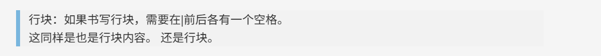
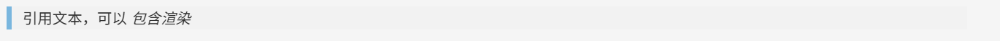
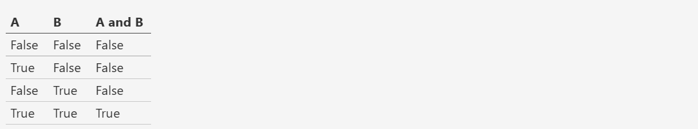

昨天我对照着一份教程试着写RST文件，来学习RST文件编写相关的语法。

里面很多缩进和空行的要求真的弄得我头都大了。🥹💥💥

今天我想把这些RST文件的学习资料转换为md文件上传到我的博客中来，让我们开始吧~

<!-- more -->


## RST转换为MD

安装pandoc：

```powershell
choco install pandoc
```

使用如下脚本将RST文件批量转换为MD文件： （DeepSeek大大 大法好）

```python
import os
import subprocess
from pathlib import Path
from datetime import datetime
import re

def extract_title_from_rst(content):
    """从RST内容中提取标题"""
    lines = content.split('\n')
    for i, line in enumerate(lines):
        if i + 1 < len(lines) and lines[i+1].strip() and (
            lines[i+1].replace('=', '').replace('-', '').replace('~', '').strip() == ''):
            return lines[i].strip()
    # 如果没有找到标题格式，使用文件名
    return None

def convert_rst_to_jekyll_md():
    """转换RST为Jekyll可用的Markdown"""
    rst_files = list(Path('.').glob('*.rst'))
    
    if not rst_files:
        print("未找到.rst文件")
        return
    
    print(f"找到 {len(rst_files)} 个RST文件:")
    for file in rst_files:
        print(f"  - {file.name}")
    
    # 检查pandoc
    try:
        subprocess.run(['pandoc', '--version'], capture_output=True)
    except FileNotFoundError:
        print("错误: 请先安装Pandoc")
        return
    
    print("\n开始转换...")
    
    for rst_file in rst_files:
        # 读取RST内容来提取标题
        with open(rst_file, 'r', encoding='utf-8') as f:
            rst_content = f.read()
        
        # 提取标题
        title = extract_title_from_rst(rst_content)
        if not title:
            title = rst_file.stem.replace('_', ' ').title()
        
        # 转换内容
        md_content = subprocess.run([
            'pandoc', '-f', 'rst', '-t', 'markdown+hard_line_breaks+auto_identifiers',
            str(rst_file)
        ], capture_output=True, text=True, encoding='utf-8').stdout
        
        # 创建Jekyll front matter
        front_matter = f"""---
layout: post
title: "{title}"
date: {datetime.now().strftime('%Y-%m-%d %H:%M:%S')}
categories: blog
---
"""
        # 写入最终文件
        output_file = rst_file.with_suffix('.md')
        with open(output_file, 'w', encoding='utf-8') as f:
            f.write(front_matter)
            f.write('\n')
            f.write(md_content)
        
        print(f"✅ 成功转换: {rst_file.name} → {output_file.name}")

if __name__ == "__main__":
    convert_rst_to_jekyll_md()
```


## reStructuredText语法

### 理解reST

reStructuredText（RST，ReST或reST）是一种用于文本数据的文件格式，主要用于Python语言社区的技术文档。 

它是Python Doc-SIG（Documentation Spacial Interest Group）的Docutils项目的一部分，旨在从Python程 序中提取注释和信息，并将其格式化为各种形式的程序文档。

学习本章reStructureText语法，首先理解两种标记元 素：指令（Directives）和角色（Role）。

区别在于指令是块级元素，像段落一样使用。角色是行内元素，可以写在普通文本之中。


### 安装插件

在VS Code中安装RST Preview可以对rst文件进行预览


### 标题 🚩

RST中没有特定的字符给定标题级别，结构式根据继承的标题来确定的。可以自行选用习惯的符号。

本篇使用# \* + = ：来 标记一、二、三、四、五、六级标题。

语法格式：

    一级标题
    ##########
    二级标题
    **********
    三级标题
    ++++++++++
    四级标题
    ==========
    五级标题
    ::::::::::

渲染效果：


> 注意：
>
> 1.  标题符号的数量必须大于等于标题文本的长度。
> 2.  标题级别递进是按顺序的，这一点与Markdown语法不同，否则渲染失败
> 3.  全文标题标记符号要保持一致。


### 段落 🚩

段落是RST文档的基本模块，由一个或多个空白行形成的文本块。

段落是被空行分割的文字片段，左侧必须对齐。


语法格式：

- 普通的文本段落或块级元素之间，必须用空行加以区分。可按两下回车继续书写。 

- 同一段落所有行必须左对齐并且同一级缩进。每级缩进4个空格，或者设置Tab健自动转为4个空格。

- 缩进的段落视为引文。

源码：

```rst
    普通的文本段落或块级元素之间，必须用空行加以区分。可按两下回车继续书写。
    同一段落所有行必须左对齐并且同一级缩进。每级缩进4个空格，或者设置Tab健自动转为4个空格。

    缩进的段落视为引文。
```

渲染效果：


### 行块

语法：

如果书写行块，需要在|前后各有一个空格。

源码：

```rst
 | 行块：如果书写行块，需要在|前后各有一个空格。
 | 这同样是也是行块内容。 还是行块。
```

渲染效果：




### 文字块 🚩

文字块就是一段文字信息，在需要插入文本块的段落后面加 `::`, 接着一个空行，就是文字块。 

文字块不能顶格写，要有缩进，结束标志是新的一个段落开头。

源码：

```rst
::

    这是一个文字块
    这是文字块的第二行
    这是文字块的第三行

这是结束的地方。
```

渲染效果：


### 定义

源码：

```rst
定义1
	这是定义1
定义2
	这是定义2
```

渲染效果：


### 斜体  🚩

源码：

```rst
*斜体*
```


### 粗体 🚩

源码：

```rst
**粗体**
```


> 注意：
>
> - 格式标记不可相互嵌套；
>
> - 星号及反引号在文本中容易与内联标记符号混淆，可使用反斜杠符号转义； 如果内容需要特殊字符分隔，可使用反斜杠转义，如: `thisis\ *one*\ word.`
> - 文本与格式标记符号之间不要留空格， `* text*` 不能实现渲染效果。


### 分隔符

与 Markdown 类似，分隔符用4个或以上 - 组成，需要添加换行。

源码：

```rst
上面部分

----

下面部分
```

渲染效果如下：

上面部分

------------------------------------------------------------------------

下面部分


### 脚注  🚩

在文档中添加脚注，文内使用 `[#name]_` 标注脚注，文末使用 `.. rubric:: Footnotes` 添加脚注的内容。 

源码：

```rst
Let's learn reStructuredText [#f1]_ ! You'll see a footnote [#f2]_.

.. rubric:: Footnotes

.. [#f1] reStructuredText 是一种轻量级标记语言。
.. [#f2] 这是第二条脚注.
```

渲染效果：


有点像MD的脚注。（看来MD的语法我也得系统学习一下了🤡🤡）

Let\'s learn reStructuredText [[1]][1] ! You\'ll see a footnote [[2]][2].


**Footnotes**

[1]: 这是第一条脚注
[2]:  这是第二条脚注


### 列表

官方文档介绍了多种列表形式，优先掌握前两种，其余形式可以在应用时对照书写。


### 无序 列表 🚩

无序列表使用星号(\*)、加号(+)或是减号(-)作为列表标记。语法格式如下： :

```rst
* 第一项
* 第二项
* 第三项

+ 第一项
+ 第二项
+ 第三项

- 第一项
- 第二项
- 第三项
```

渲染效果都是：

- 第一项
- 第二项
- 第三项


### 有序列表 🚩

有序列表使用数字加点号（.）作为列表标记。

语法格式：

```rst
1. 第一项
2. 第二项
3. 第三项
```

渲染效果如下：

1.  第一项
2.  第二项
3.  第三项


如果项很多，可以通过使用标志 \# 自动编号有序列表，也可以和数字混用。

```rst
#. 第一项
#. 第二项
#. 第三项
```

渲染效果如下：

1.  第一项
2.  第二项
3.  第三项


### 定义列表

定义列表第一行写term，类似于列表一项名称，中间换行，不需要空行，缩进一级书写内容。

语法格式：

```rst
term 1
    这是term 1的定义内容
term 2
    这是term 2的定义内容
term 3
    这是term 3的定义内容
```

渲染效果：

term 1

​		这是term 1的定义内容

term 2

​		这是term 2的定义内容

term 3

​		这是term 3的定义内容


### 字段列表

使用`:term:` 和 `:term:`，在行内紧接着写项的内容。

源码：

```rst
:what: 第一项
:how: 第二项
```

渲染效果：


### 选项列表

使用 `-term`， 后面与具体内容间留出两个或以上空格。

源码：

```rst
-a  选项一
-b  选项二
```

渲染效果：


定义列表、字段列表、选项列表三种形式都可以灵活用自己 term，保证 term 只有一个文本行即可。


### 列表嵌套 🚩

与 Markdown 语法类似，RST 中也可以实现列表嵌套。注意父列表与子列表要以空行分隔。

eg1：

```rst
1. 父列表第一项
2. 父列表第二项

* 子列表第一项
* 子列表第二项

3. 父列表第三项
```

渲染效果：

1.  父列表第一项
2.  父列表第二项

- 子列表第一项
- 子列表第二项

3.  父列表第三项


eg2：

```rst
- 符号列表1
- 符号列表2

    + 二级符号列表1

    - 二级符号列表2

    * 二级符号列表3

* 符号列表3

+ 符号列表4
```

渲染效果：


>Note：
>
>符号列表可以使用 `-` 、 `*` 、 `+` 来表示。
>
>不同的符号结尾需要加上空行，下级列表需要有空格缩进。


### 代码


### 单行代码

通过反引号``实现：

```rst
``text``
```


### 代码区块

在段落后使用两个连续英文引号标记`::`引出原始文本块。  

代码块段落缩进，多行代码中间不需要空行，与其他文本前后空行分隔， 最后有空行，缩进退回到`::`的位置，就表示退出原始文本块。

源码：

```
第一段文本 ::         

	代码区块演示        
	展示源代码，不会***渲染***。      

第二段文本
```

  渲染效果：


> 提示：在 reStructuredText 中，`::`是很神奇的标记：      
>
> 1. 如果`::`标记作为独立段落存在，则整段都不会出现在文档里
> 2. 如果`::`标记前面有空白，标记将被删除
> 3. 如果`::`标记前面非空白，标记会被单个冒号取代。   


### 块级代码  🚩

原始文本块不会转换内部的字符，如果有时候写源代码，希望能高亮显示，就需要使用块级代码。

源码：

```rst
	.. code-block:: c          
	
		void foo()         
		{             
			int i;              
			for(i=0; i<10; i++)                 
				printf("i: %d\n", a);         
		}
    
    
	.. code-block:: python              
		
		def hello():             
			print("Hello, World!")             
			return True       
	
	
	.. code:: php              
	
		<?php                 
			if(1 == 1){                     
				$joke = "Life is short, not int.";                 
			}             
		?>    
```

渲染效果：


### 引用纯文本

在reStructuredText中，引用有两种方式，但无论哪一种，引用中都不能使用标题。 

引用一段不需要渲染的纯文本，可以直接使用`::`，标记方式类似上一小节代码：

```rst
::

	引用文本
```

渲染效果：


### 引用带格式文本

如果想在引用里也使用 reStructuredText 的语法标记，缩进就可以实现了，引用会自动换行：

```rst
(Tab)引用文本，可以 *包含渲染*
```

渲染效果：




### 链接   🚩

### 外部链接

使用外部链接最简便的方式是直接粘贴网址，两端用空格和文本隔开，reStructuredText 会自动把网址转成超链接。如：`<http://www.ss.pku.edu.cn>`

渲染效果如下：  

北京大学软件与微电子学院: http://www.ss.pku.edu.cn  

更推荐的形式，是用锚文本来显示一个链接，尖括号包裹网址放在文本后面，注意空格。 用一对反引号包裹它们，结尾跟一个下划线。基本标记格式为：

```rst
`链接文本<网址>`_
```

可参考资料：[Sphinx官网][http://www.sphinx-doc.org/en/master/] ,  [reStructuredText 详细说明][https://docutils.sourceforge.io/docs/ref/rst/restructuredtext.html#sections]

### 内部链接

内部链接是通过Sphinx提供的reST role来实现的。每一级标题都会变成一个锚，标题名加下划线即可创建 跳到此位置的链接。比如回到引用带格式文本所在位置学习： 

```rst
引用带格式文本_
```

如果标题当中含有空格，则需要使用反引号将标题括起来。

比如回到“无序 列表“一节学习， 语法格式为：

```rst
`无序 列表`_
```

> 提示：虽然内部链接一般不需要，但写链接时可以统一使用反引号包裹，记忆负担较小。


### 插入图片  🚩

图片是块级元素，要单独成段，一般不能嵌入行内。建议优先使用源文件的相对路径。

源码：

```rst
.. image:: 路径/文件名
```

比如在将 sphinx 图片存入与这篇指南同一文件夹 images 下，插入图片的语法格式为： :

    .. image:: images/moon.jpg

插入图片如下：


如果是绝对路径，则以文件的源目录为根目录。此外添加图片的形式也可以以网址链接形式添加。


### 图片格式

图片后还可以加入一些额外选项，如大小选项：宽度width和高度height。 如果没有单位或单位为像素, 给定的尺寸信息仅在输出通道支持像素时才有用，如输出 LaTeX 没用； 其他单位(如 pt)在输出 HTML、LaTeX 时被用到.添加选项的格式如： :

```rst
.. image:: picture.jpeg
   :height: 100px
   :width: 200 px
   :scale: 50 %
   :alt: alternate text
   :align: right
```

如果把上一个例子插入的图片缩小一些，那么语法格式可以为： :

    .. image:: images/moon.jpg
       :height: 1100px

插入图片如下：

{height="800px"}


### 图片输出形式

Sphinx会自动将图像文件拷贝到输出目录中（例如 HTML格式输出，会拷贝到 _static目录中。）

Sphinx 延伸了标准的文档化行为，只需在后面加星号： :

    .. image:: 图片名.*

这样写 Sphinx 就会搜索所有名字匹配的图像，而不管图像类型. 每个生成器则会选择最合适的图像. 源文件目录里同一文件名可能含有 pdf 和 png 两个文件, LaTeX 生成器会选择前者，而 HTML 生成器会匹配后者.


### 表格

reStructuredText 主要有两种表格形式，简单表格和网格表格。


### 简单表格

简单表格书写简单, 基础形式好上手。要求有多行，且第一列元素不能分行显示。

构成简单表格的标记主要是\"=\"：用于绘制表格上方、下方框线，以及分隔标题，比如：

```rst
=====  =====  =======
  A      B    A and B
=====  =====  =======
False  False  False
True   False  False
False  True   False
True   True   True
=====  =====  =======
```

渲染效果：




在此基础上，每格内容如图所示可以相应使用\"-\"分隔表头，但不支持合并单元格： :

```rst
=====  =====  ======
   Inputs     Output
------------  ------
  A      B    A or B
=====  =====  ======
False  False  False
True   False  True
False  True   True
True   True   True
=====  =====  ======
```

渲染效果：


如果一些单元格没有内容，需要用转义符或者\"..\"表示，否则会被视为上一行的延续：

```rst
=====  =====
col 1  col 2
=====  =====
1      Second column of row 1.
2      Second column of row 2.
       Second line of paragraph.
3      - Second column of row 3.

       - Second item in bullet
         list (row 3, column 2).
\      Row 4; column 1 will be empty.
=====  =====
```

渲染效果：


### 网格表格

网格表格可以自定义表格的边框，更灵活，但绘制相对复杂。构成网格表格的标记有以下几种：

- \"-\"用于绘制横线，分隔各行；
- \"=\"用于分隔标题与表格主体，但标题可有可无，视情况而定；
- \"\|\"用于绘制竖线，分隔各列；
- \"+\"用在行与列的交界处。

网格表格支持合并单元格，内部也可以嵌套列表。官方示例囊括了这些细节： :

    +------------------------+------------+----------+----------+
    | Header row, column 1   | Header 2   | Header 3 | Header 4 |
    +========================+============+==========+==========+
    | body row 1, column 1   | column 2   | column 3 | column 4 |
    +------------------------+------------+----------+----------+
    | body row 2             | Cells may span columns.          |
    +------------------------+------------+---------------------+
    | body row 3             | Cells may  | - Table cells       |
    +------------------------+ span rows. | - contain           |
    | body row 4             |            | - body elements.    |
    +------------------------+------------+---------------------+

渲染效果：


> 提示：
>
> 纯手打表格比较麻烦，书写中文内容标记难以对齐。
>
> 如果精力允许，可以尝试 Emacs 编辑器绘制网格表格。


### 列表表格

此外，还有一种特殊的列表表格，通过创建一组嵌套的列表来渲染成表。

父级列表是行，每一行的子列表是列，每行的列数必须一致，不支持合并单元格），缺少的格用空出占位。比如：

```rst
.. list-table::

    * - 单行代码
      - 代码区块
      - 代码高亮
    * - 简单表格
      - 网格表格
      - 列表表格
    * - 外部链接
      - 内部链接
      - 
```

渲染效果：


