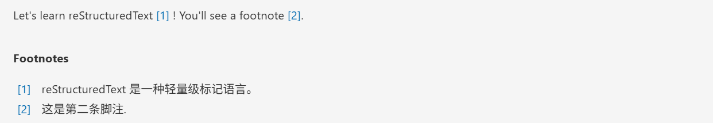

昨天我对照着一份教程试着写RST文件，来学习RST文件编写相关的语法。

里面很多缩进和空行的要求真的弄得我头都大了。🥹💥💥

今天我想把这些RST文件的学习资料转换为md文件上传到我的博客中来，让我们开始吧~

<!-- more -->


## RST转换为MD

安装pandoc：

```powershell
choco install pandoc
```

使用如下脚本将RST文件批量转换为MD文件： （DeepSeek大大 大法好）

```python
import os
import subprocess
from pathlib import Path
from datetime import datetime
import re

def extract_title_from_rst(content):
    """从RST内容中提取标题"""
    lines = content.split('\n')
    for i, line in enumerate(lines):
        if i + 1 < len(lines) and lines[i+1].strip() and (
            lines[i+1].replace('=', '').replace('-', '').replace('~', '').strip() == ''):
            return lines[i].strip()
    # 如果没有找到标题格式，使用文件名
    return None

def convert_rst_to_jekyll_md():
    """转换RST为Jekyll可用的Markdown"""
    rst_files = list(Path('.').glob('*.rst'))
    
    if not rst_files:
        print("未找到.rst文件")
        return
    
    print(f"找到 {len(rst_files)} 个RST文件:")
    for file in rst_files:
        print(f"  - {file.name}")
    
    # 检查pandoc
    try:
        subprocess.run(['pandoc', '--version'], capture_output=True)
    except FileNotFoundError:
        print("错误: 请先安装Pandoc")
        return
    
    print("\n开始转换...")
    
    for rst_file in rst_files:
        # 读取RST内容来提取标题
        with open(rst_file, 'r', encoding='utf-8') as f:
            rst_content = f.read()
        
        # 提取标题
        title = extract_title_from_rst(rst_content)
        if not title:
            title = rst_file.stem.replace('_', ' ').title()
        
        # 转换内容
        md_content = subprocess.run([
            'pandoc', '-f', 'rst', '-t', 'markdown+hard_line_breaks+auto_identifiers',
            str(rst_file)
        ], capture_output=True, text=True, encoding='utf-8').stdout
        
        # 创建Jekyll front matter
        front_matter = f"""---
layout: post
title: "{title}"
date: {datetime.now().strftime('%Y-%m-%d %H:%M:%S')}
categories: blog
---
"""
        # 写入最终文件
        output_file = rst_file.with_suffix('.md')
        with open(output_file, 'w', encoding='utf-8') as f:
            f.write(front_matter)
            f.write('\n')
            f.write(md_content)
        
        print(f"✅ 成功转换: {rst_file.name} → {output_file.name}")

if __name__ == "__main__":
    convert_rst_to_jekyll_md()
```


## reStructuredText语法 上篇

### 理解reST

reStructuredText（RST，ReST或reST）是一种用于文本数据的文件格式，主要用于Python语言社区的技术文档。 

它是Python Doc-SIG（Documentation Spacial Interest Group）的Docutils项目的一部分，旨在从Python程 序中提取注释和信息，并将其格式化为各种形式的程序文档。

学习本章reStructureText语法，首先理解两种标记元 素：指令（Directives）和角色（Role）。

区别在于指令是块级元素，像段落一样使用。角色是行内元素，可以写在普通文本之中。


### 安装插件

在VS Code中安装RST Preview可以对rst文件进行预览


### 标题 🚩

RST中没有特定的字符给定标题级别，结构式根据继承的标题来确定的。可以自行选用习惯的符号。

本篇使用# \* + = ：来 标记一、二、三、四、五、六级标题。

语法格式：

    一级标题
    ##########
    二级标题
    **********
    三级标题
    ++++++++++
    四级标题
    ==========
    五级标题
    ::::::::::

渲染效果：


> 注意：
>
> 1.  标题符号的数量必须大于等于标题文本的长度。
> 2.  标题级别递进是按顺序的，这一点与Markdown语法不同，否则渲染失败
> 3.  全文标题标记符号要保持一致。

### 段落 

#### 段落 🚩

段落是RST文档的基本模块，由一个或多个空白行形成的文本块。

段落是被空行分割的文字片段，左侧必须对齐。


语法格式：

- 普通的文本段落或块级元素之间，必须用空行加以区分。可按两下回车继续书写。 

- 同一段落所有行必须左对齐并且同一级缩进。每级缩进4个空格，或者设置Tab健自动转为4个空格。

- 缩进的段落视为引文。

源码：

```rst
    普通的文本段落或块级元素之间，必须用空行加以区分。可按两下回车继续书写。
    同一段落所有行必须左对齐并且同一级缩进。每级缩进4个空格，或者设置Tab健自动转为4个空格。

    缩进的段落视为引文。
```

渲染效果：


#### 行块

语法：

如果书写行块，需要在`|`前后各有一个空格。

源码：

```rst
 | 行块：如果书写行块，需要在|前后各有一个空格。
 | 这同样是也是行块内容。 还是行块。
```

渲染效果：


#### 文字块 🚩

文字块就是一段文字信息，在需要插入文本块的段落后面加 `::`, 接着一个空行，就是文字块。 

文字块不能顶格写，要有缩进，结束标志是新的一个段落开头。

源码：

```rst
::

    这是一个文字块
    这是文字块的第二行
    这是文字块的第三行

这是结束的地方。
```

渲染效果：


### 定义

源码：

```rst
定义1
	这是定义1
定义2
	这是定义2
```

渲染效果：


### 字体

#### 斜体  🚩

源码：

```rst
*斜体*
```

渲染效果：
*斜体*


#### 粗体 🚩

源码：

```rst
**粗体**
```
渲染效果：
**粗体**


> 注意：
>
> - 格式标记不可相互嵌套；
>
> - 星号及反引号在文本中容易与内联标记符号混淆，可使用反斜杠符号转义； 如果内容需要特殊字符分隔，可使用反斜杠转义，如: `thisis\ *one*\ word.`
> - 文本与格式标记符号之间不要留空格， `* text*` 不能实现渲染效果。


### 分隔符

与 Markdown 类似，分隔符用4个或以上 - 组成，需要添加换行。

源码：

```rst
上面部分

----

下面部分
```

渲染效果如下：

上面部分

------------------------------------------------------------------------

下面部分


### 脚注  🚩

在文档中添加脚注，文内使用 `[#name]_` 标注脚注，文末使用 `.. rubric:: Footnotes` 添加脚注的内容。 

源码：

```rst
Let's learn reStructuredText [#f1]_ ! You'll see a footnote [#f2]_.

.. rubric:: Footnotes

.. [#f1] reStructuredText 是一种轻量级标记语言。
.. [#f2] 这是第二条脚注.
```

渲染效果：



有点像MD的脚注。（看来MD的语法我也得系统学习一下了🤡🤡）

Let\'s learn reStructuredText [[1]][1] ! You\'ll see a footnote [[2]][2].


**Footnotes**

[1]: 这是第一条脚注
[2]:  这是第二条脚注

### 列表

官方文档介绍了多种列表形式，优先掌握前两种，其余形式可以在应用时对照书写。


#### 无序 列表 🚩

无序列表使用星号(\*)、加号(+)或是减号(-)作为列表标记。语法格式如下： :

```rst
* 第一项
* 第二项
* 第三项

+ 第一项
+ 第二项
+ 第三项

- 第一项
- 第二项
- 第三项
```

渲染效果都是：

- 第一项
- 第二项
- 第三项


#### 有序列表 🚩

有序列表使用数字加点号（.）作为列表标记。

语法格式：

```rst
1. 第一项
2. 第二项
3. 第三项
```

渲染效果如下：

1.  第一项
2.  第二项
3.  第三项


如果项很多，可以通过使用标志 \# 自动编号有序列表，也可以和数字混用。

```rst
#. 第一项
#. 第二项
#. 第三项
```

渲染效果如下：

1.  第一项
2.  第二项
3.  第三项


#### 定义列表

定义列表第一行写term，类似于列表一项名称，中间换行，不需要空行，缩进一级书写内容。

语法格式：

```rst
term 1
    这是term 1的定义内容
term 2
    这是term 2的定义内容
term 3
    这是term 3的定义内容
```

渲染效果：

term 1

		这是term 1的定义内容

term 2

		这是term 2的定义内容

term 3

		这是term 3的定义内容


#### 字段列表

使用`:term:` 和 `:term:`，在行内紧接着写项的内容。

源码：

```rst
:what: 第一项
:how: 第二项
```

渲染效果：


#### 选项列表

使用 `-term`， 后面与具体内容间留出两个或以上空格。

源码：

```rst
-a  选项一
-b  选项二
```

渲染效果：


定义列表、字段列表、选项列表三种形式都可以灵活用自己 term，保证 term 只有一个文本行即可。


#### 列表嵌套 🚩

与 Markdown 语法类似，RST 中也可以实现列表嵌套。注意父列表与子列表要以空行分隔。

eg1：

```rst
1. 父列表第一项
2. 父列表第二项

* 子列表第一项
* 子列表第二项

3. 父列表第三项
```

渲染效果：

1.  父列表第一项
2.  父列表第二项

- 子列表第一项
- 子列表第二项

3.  父列表第三项


eg2：

```rst
- 符号列表1
- 符号列表2

    + 二级符号列表1

    - 二级符号列表2

    * 二级符号列表3

* 符号列表3

+ 符号列表4
```

渲染效果：


>Note：
>
>符号列表可以使用 `-` 、 `*` 、 `+` 来表示。
>
>不同的符号结尾需要加上空行，下级列表需要有空格缩进。


