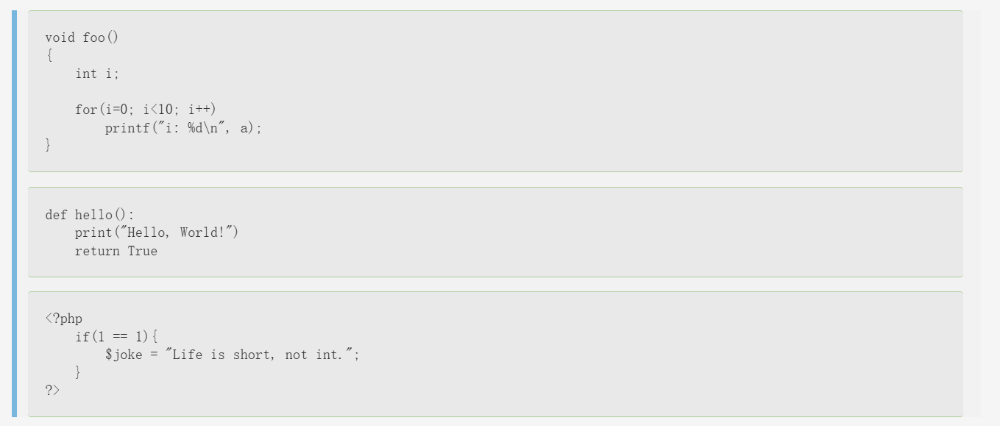
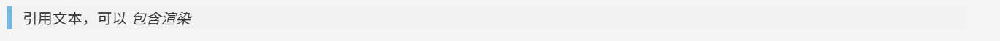
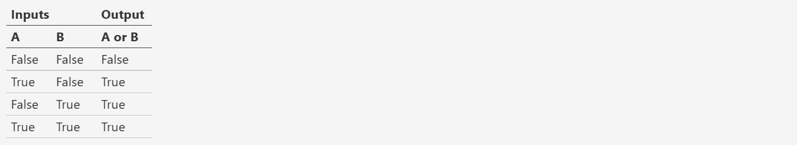
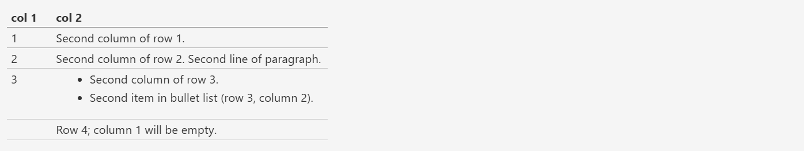
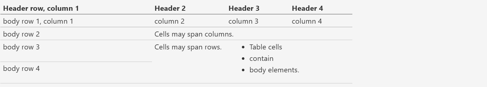
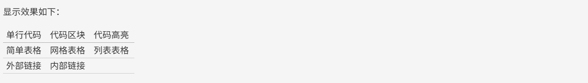

之前写的RST语法篇幅太长了，发现这个博客模板的目录页都没有办法下拉🤡，我又不会改。

我就分成了上下两篇来写，此为下篇。

<!-- more -->

## reStructuredText语法 下篇

### 代码

#### 单行代码

通过反引号``实现：

```
``text``
```


#### 代码区块

在段落后使用两个连续英文引号标记`::`引出原始文本块。  

代码块段落缩进，多行代码中间不需要空行，与其他文本前后空行分隔， 最后有空行，缩进退回到`::`的位置，就表示退出原始文本块。

源码：

```
第一段文本 ::         

	代码区块演示        
	展示源代码，不会***渲染***。      

第二段文本
```

  渲染效果：


> 提示：在 reStructuredText 中，`::`是很神奇的标记：      
>
> 1. 如果`::`标记作为独立段落存在，则整段都不会出现在文档里
> 2. 如果`::`标记前面有空白，标记将被删除
> 3. 如果`::`标记前面非空白，标记会被单个冒号取代。   


#### 块级代码  🚩

原始文本块不会转换内部的字符，如果有时候写源代码，希望能高亮显示，就需要使用块级代码。

源码：

```
	.. code-block:: c          
	
		void foo()         
		{             
			int i;              
			for(i=0; i<10; i++)                 
				printf("i: %d\n", a);         
		}
    
    
	.. code-block:: python              
		
		def hello():             
			print("Hello, World!")             
			return True       
	
	
	.. code:: php              
	
		<?php                 
			if(1 == 1){                     
				$joke = "Life is short, not int.";                 
			}             
		?>    
```

渲染效果：




### 引用

#### 引用纯文本

在reStructuredText中，引用有两种方式，但无论哪一种，引用中都不能使用标题。 

引用一段不需要渲染的纯文本，可以直接使用`::`，标记方式类似上一小节代码：

```
::

	引用文本
```

渲染效果：


#### 引用带格式文本

如果想在引用里也使用 reStructuredText 的语法标记，缩进就可以实现了，引用会自动换行：

```
(Tab)引用文本，可以 *包含渲染*
```

渲染效果：




#### 链接   🚩

#### 外部链接

使用外部链接最简便的方式是直接粘贴网址，两端用空格和文本隔开，reStructuredText 会自动把网址转成超链接。如：`<http://www.ss.pku.edu.cn>`

渲染效果如下：  

北京大学软件与微电子学院: http://www.ss.pku.edu.cn  

更推荐的形式，是用锚文本来显示一个链接，尖括号包裹网址放在文本后面，注意空格。 用一对反引号包裹它们，结尾跟一个下划线。基本标记格式为：

```
`链接文本<网址>`_
```

可参考资料：[Sphinx官网][http://www.sphinx-doc.org/en/master/] ,  [reStructuredText 详细说明][https://docutils.sourceforge.io/docs/ref/rst/restructuredtext.html#sections]

#### 内部链接

内部链接是通过Sphinx提供的reST role来实现的。每一级标题都会变成一个锚，标题名加下划线即可创建 跳到此位置的链接。比如回到引用带格式文本所在位置学习： 

```
引用带格式文本_
```

如果标题当中含有空格，则需要使用反引号将标题括起来。

比如回到“无序 列表“一节学习， 语法格式为：

```
`无序 列表`_
```

> 提示：虽然内部链接一般不需要，但写链接时可以统一使用反引号包裹，记忆负担较小。


### 图片
#### 插入图片  🚩

图片是块级元素，要单独成段，一般不能嵌入行内。建议优先使用源文件的相对路径。

源码：

```
.. image:: 路径/文件名
```

比如在将 sphinx 图片存入与这篇指南同一文件夹 images 下，插入图片的语法格式为： :

    .. image:: images/moon.jpg

插入图片如下：


如果是绝对路径，则以文件的源目录为根目录。此外添加图片的形式也可以以网址链接形式添加。


#### 图片格式

图片后还可以加入一些额外选项，如大小选项：宽度width和高度height。 如果没有单位或单位为像素, 给定的尺寸信息仅在输出通道支持像素时才有用，如输出 LaTeX 没用； 其他单位(如 pt)在输出 HTML、LaTeX 时被用到.添加选项的格式如： :

```
.. image:: picture.jpeg
   :height: 100px
   :width: 200 px
   :scale: 50 %
   :alt: alternate text
   :align: right
```

如果把上一个例子插入的图片缩小一些，那么语法格式可以为： :

    .. image:: images/moon.jpg
       :height: 1100px

插入图片如下：

{height="800px"}


#### 图片输出形式

Sphinx会自动将图像文件拷贝到输出目录中（例如 HTML格式输出，会拷贝到 _static目录中。）

Sphinx 延伸了标准的文档化行为，只需在后面加星号： :

    .. image:: 图片名.*

这样写 Sphinx 就会搜索所有名字匹配的图像，而不管图像类型. 每个生成器则会选择最合适的图像. 源文件目录里同一文件名可能含有 pdf 和 png 两个文件, LaTeX 生成器会选择前者，而 HTML 生成器会匹配后者.


### 表格

reStructuredText 主要有两种表格形式，简单表格和网格表格。


#### 简单表格

简单表格书写简单, 基础形式好上手。要求有多行，且第一列元素不能分行显示。

构成简单表格的标记主要是\"=\"：用于绘制表格上方、下方框线，以及分隔标题，比如：

```
=====  =====  =======
  A      B    A and B
=====  =====  =======
False  False  False
True   False  False
False  True   False
True   True   True
=====  =====  =======
```

渲染效果：


在此基础上，每格内容如图所示可以相应使用\"-\"分隔表头，但不支持合并单元格： :

```
=====  =====  ======
   Inputs     Output
------------  ------
  A      B    A or B
=====  =====  ======
False  False  False
True   False  True
False  True   True
True   True   True
=====  =====  ======
```

渲染效果：



如果一些单元格没有内容，需要用转义符或者\"..\"表示，否则会被视为上一行的延续：

```
=====  =====
col 1  col 2
=====  =====
1      Second column of row 1.
2      Second column of row 2.
       Second line of paragraph.
3      - Second column of row 3.

       - Second item in bullet
         list (row 3, column 2).
\      Row 4; column 1 will be empty.
=====  =====
```

渲染效果：




#### 网格表格

网格表格可以自定义表格的边框，更灵活，但绘制相对复杂。构成网格表格的标记有以下几种：

- \"-\"用于绘制横线，分隔各行；
- \"=\"用于分隔标题与表格主体，但标题可有可无，视情况而定；
- \"\|\"用于绘制竖线，分隔各列；
- \"+\"用在行与列的交界处。

网格表格支持合并单元格，内部也可以嵌套列表。官方示例囊括了这些细节： :

    +------------------------+------------+----------+----------+
    | Header row, column 1   | Header 2   | Header 3 | Header 4 |
    +========================+============+==========+==========+
    | body row 1, column 1   | column 2   | column 3 | column 4 |
    +------------------------+------------+----------+----------+
    | body row 2             | Cells may span columns.          |
    +------------------------+------------+---------------------+
    | body row 3             | Cells may  | - Table cells       |
    +------------------------+ span rows. | - contain           |
    | body row 4             |            | - body elements.    |
    +------------------------+------------+---------------------+

渲染效果：



> 提示：
>
> 纯手打表格比较麻烦，书写中文内容标记难以对齐。
>
> 如果精力允许，可以尝试 Emacs 编辑器绘制网格表格。


#### 列表表格

此外，还有一种特殊的列表表格，通过创建一组嵌套的列表来渲染成表。

父级列表是行，每一行的子列表是列，每行的列数必须一致，不支持合并单元格），缺少的格用空出占位。比如：

```
.. list-table::

    * - 单行代码
      - 代码区块
      - 代码高亮
    * - 简单表格
      - 网格表格
      - 列表表格
    * - 外部链接
      - 内部链接
      - 
```

渲染效果：

