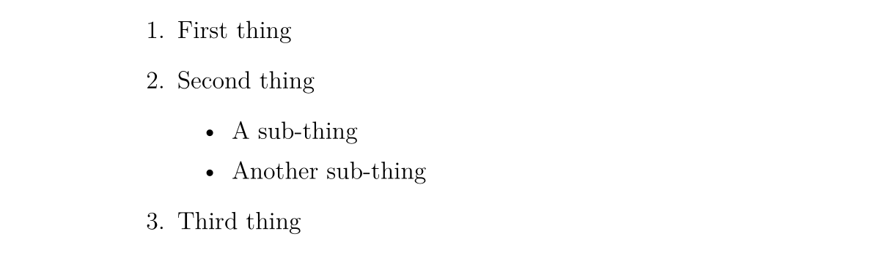
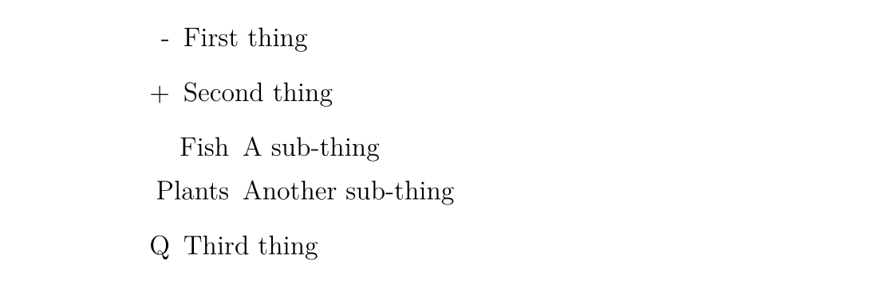

来学习一下初级的LaTex语法知识吧~
<!-- more -->

## 何为LaTeX

LaTeX是一个让我们的文档看起来更专业的排版软件。

>  可能有人会问，我们用word不就够了，为什么还要使用LaTeX呢？

确实，如果你习惯于使用Office Word处理文档，可能会觉得LaTeX的编写很不习惯。

Word是典型的【所见即所得】的编辑器，写文档的时候就能查看到最终的排版效果。而LaTeX是内容与格式分离的，使用LaTex时我们并不能方便地查看最终效果。但正是如此，LaTeX是纯文本，适合进行Git版本控制，而Word是二进制文件，是直接格式化的，版本对比困难，难以维护其一致性。`.tex` 结尾的文本文件可以用任意文本编辑器编辑，编辑过程中我们可以标记文档的结构。在编辑LaTeX的过程中我们可以标记文档结构，完成后我们可以进行编译，可以转换为另一种格式的文档。但最常用的是导出PDF格式。

LaTeX常见应用在：

- 技术白皮书
- API文档
- 产品说明书
- 标准文档
- 论文和技术报告


首先安装TeX Live (https://tug.org/texlive/) 和 TeXStudio (https://texstudio.org/ )，不详细展开。

在TeX Studio中需要配置各种latex exe文件的路径。【选项】【设置TeXStudio】【命令】


## 文档结构

### 基本要素

新建一个tex文档

```
\documentclass[a4paper, 12pt]{article}

\begin{document}
  A sentence of text.
\end{document}
```

`\documentclass` 命令必须出现在每个 LaTeX 文档的开头。花括号内的文本指定了文档的类型。

**article** 文档类型适合较短的文章，比如期刊文章和短篇报告。

其他文档类型包括 **report**（适用于更长的多章节的文档，比如博士生论文），**proc**（会议论文集），**book** 和 **beamer**。方括号内的文本指定了一些选项——示例中它设置纸张大小为 A4，主要文字大小为 12pt。

`\begin{document}` 和 `\end{document}` 命令将你的文本内容包裹起来。任何在 `\begin{document}` 之前的文本都被视为前导命令，会影响整个文档。任何在 `\end{document}` 之后的文本都会被忽视。

空行不是必要的，但它可以让长的文档更易读。

【选项】【设置TeX Studio】【构建】中选择XeLaTeX作为默认编译器。点击**编译**按钮，源文件会被转换为 PDF 文档，这需要花费一定的时间。在编译结束后，TeXworks 的 PDF 查看器会打开并预览生成的文件。PDF 文件会被自动地保存在与 TeX 文档相同的目录下。


### 文档标题

`\maketitle` 命令可以给文档创建标题。你需要指定文档的标题。如果没有指定日期，就会使用现在的时间，作者是可选的。

→ 在 `\begin{document}` 和 命令后紧跟着输入以下文本：

```
\title{My First Document}
\author{My Name}
\date{\today}
\maketitle
```

你的文档现在长成了这样：

```
\documentclass[a4paper, 12pt]{article}

\begin{document}
  \title{My First Document}
  \author{My Name}
  \date{\today}
  \maketitle

  A sentence of text.
\end{document}
```

→ 点击 **编译** 按扭，核对生成的 PDF 文档。

要点笔记：

- `\today` 是插入当前时间的命令。你也可以输入一个不同的时间，比如 `\date{November 2013}`。
- **article** 文档的正文会紧跟着标题之后在同一页上排版。**report** 会将标题置为单独的一页。


### 章节

如果需要的话，你可能想将你的文档分为章（Chatpers）、节（Sections）和小节（Subsections）。下列分节命令适用于 **article** 类型的文档：

- `\section{...}`
- `\subsection{...}`
- `\subsubsection{...}`
- `\paragraph{...}`
- `\subparagraph{...}`

花括号内的文本表示章节的标题。对于 **report** 和 **book** 类型的文档我们还支持 `\chapter{...}` 的命令。

→ 将 "A sentence of text." 替换为以下文本：

```
\section{Introduction}
This is the introduction.

\section{Methods}

\subsection{Stage 1}
The first part of the methods.

\subsection{Stage 2}
The second part of the methods.

\section{Results}
Here are my results.
```


### 创建标签

你可以对任意章节命令创建标签，这样他们可以在文档的其他部分被引用。使用 `\label{labelname}` 对章节创建标签。然后输入 `\ref{labelname}` 或者 `\pageref{labelname}` 来引用对应的章节。

→ 在 `\subsection{Stage 1}` 下面另起一行，输入 `\label{sec1}`。
→在 **Results** 章节输入 `Referring to section \ref{sec1} on page \pageref{sec1}`。

你的文档会变成这样：

```
\documentclass[a4paper, 12pt]{article}

\begin{document}
  \title{My First Document}
  \author{My Name}
  \date{\today}
  \maketitle

  \section{Introduction}
  This is the introduction.

  \section{Methods}

  \subsection{Stage 1}
  \label{sec1} The first part of the methods.

  \subsection{Stage 2}
  The second part of the methods.

  \section{Results}
  Here are my results. Referring to section \ref{sec1} on page \pageref{sec1}
\end{document}
```

→编译并检查 PDF 文档（你可能需要连续编译两次）：


### 生成目录（TOC）

如果你使用分节命令，那么可以容易地生成一个目录。使用 `\tableofcontents` 在文档中创建目录。通常我们会在标题的后面建立目录。

你可能也想也想更改页码为罗马数字（i,ii,iii）。这会确保文档的正文从第 1 页开始。页码可以使用 `\pagenumbering{...}` 在阿拉伯数字和罗马数字见切换。

→ 在 `\maketitle` 之后输入以下内容：

```
\pagenumbering{roman}
\tableofcontents
\newpage
\pagenumbering{arabic}
```

`\newpage` 命令会另起一个页面，这样我们就可以看到 `\pagenumbering` 命令带来的影响了。你的文档的前 14 行长这样：

```
\documentclass[a4paper, 12pt]{article}

\begin{document}

\title{My First Document}
\author{My Name}
\date{\today}
\maketitle

\pagenumbering{roman}
\tableofcontents
\newpage
\pagenumbering{arabic}
```

→编译并核对文档（可能需要多次编译，下文不赘述）。

文档的第一页长这样：


第二页：


## 文字处理


### 中文字体支持

阅读本文学习 LaTeX 的人，首要学会的自然是 LaTeX 的中文字体支持。事实上，让 LaTeX 支持中文字体有许多方法。在此我们仅给出最 **简洁** 的解决方案：使用 CTeX 宏包。只需要在文档的前导命令部分添加：

```
\usepackage[UTF8]{ctex} 
```

就可以了。在编译文档的时侯使用 `xelatex` 命令，因为它是支持中文字体的。


### 字体效果

LaTeX 有多种不同的字体效果，在此列举一部分：

```
\textit{words in italics} \textsl{words slanted} \textsc{words in smallcaps} \textbf{words in bold} \texttt{words in teletype} \textsf{sans serif words} \textrm{roman words} \underline{underlined words} 
```

效果如下：


→在你的文档中添加更多的文本并尝试各种字体效果。


### 彩色字体

为了让你的文档支持彩色字体，你需要使用包（package）。你可以引用很多包来增强 LaTeX 的排版效果。包引用的命令放置在文档的前导命令的位置（即放在 `\begin{document}` 命令之前）。使用 `\usepackage[options]{package}` 来引用包。其中 **package** 是包的名称，而 **options** 是指定包的特征的一些参数。

使用 `\usepackage{color}` 后，我们可以调用常见的颜色：


使用彩色字体的代码为


```
{\color{colorname}text} 
```

其中 **colorname** 是你想要的颜色的名字，**text** 是你的彩色文本内容。注意到示例效果中的黄色与白色是有文字背景色的，这个我们同样可以使用 Color 包中的 `\colorbox` 命令来达到。用法如下：


```
\colorbox{colorname}{text} 
```

→在 `\begin{document}` 前输入 `\usepackage{color}`。
→在文档内容中输入 `{\color{red}fire}`。
→编译并核对 PDF 文档内容。

单词 fire 应该是红色的。

你也可以添加一些参数来调用更多的颜色，甚至自定义你需要的颜色。但这部分超出了本书的内容。如果想要获取更多关于彩色文本的内容请阅读 LaTeX Wikibook 的 [Colors 章节](http://en.wikibooks.org/wiki/LaTeX/Colors)。


### 字体大小

接下来我们列举一些 LaTeX 的字体大小设定命令：

```
normal size words {\tiny tiny words} {\scriptsize scriptsize words} {\footnotesize footnotesize words} {\small small words} {\large large words} {\Large Large words} {\LARGE LARGE words} {\huge huge words} 
```

效果如下：


→尝试为你的文本调整字体大小。


### 段落缩进

LaTeX 默认每个章节第一段首行顶格，之后的段落首行缩进。如果想要段落顶格，在要顶格的段落前加 `\noindent` 命令即可。如果希望全局所有段落都顶格，在文档的某一位置使用 `\setlength{\parindent}{0pt}` 命令，之后的所有段落都会顶格。


### 列表

LaTeX 支持两种类型的列表：有序列表（enumerate）和无序列表（itemize）。列表中的元素定义为 `\item`。列表可以有子列表。

→ 输入下面的内容来生成一个有序列表套无序列表：

```
\begin{enumerate}
  \item First thing

  \item Second thing
    \begin{itemize}
      \item A sub-thing

      \item Another sub-thing
    \end{itemize}

  \item Third thing
\end{enumerate}
```

→ 编译并核对 PDF 文档。

列表长这样：



可以使用方括号参数来修改无序列表头的标志。例如，`\item[-]` 会使用一个杠作为标志，你甚至可以使用一个单词，比如 `\item[One]`。

下面的代码：

```
\begin{itemize}
  \item[-] First thing

  \item[+] Second thing
    \begin{itemize}
      \item[Fish] A sub-thing

      \item[Plants] Another sub-thing
    \end{itemize}

  \item[Q] Third thing
\end{itemize}
```

生成的效果为



### 注释和空格

我们使用 % 创建一个单行注释，在这个字符之后的该行上的内容都会被忽略，直到下一行开始。

下面的代码：

```
It is a truth universally acknowledged% Note comic irony
in the very first sentence , that a single man in possession of a good fortune,
must be in want of a wife.
```

生成的结果为


多个连续空格在 LaTeX 中被视为一个空格。多个连续空行被视为一个空行。空行的主要功能是开始一个新的段落。通常来说，LaTeX 忽略空行和其他空白字符，两个反斜杠（`\\`）可以被用来换行。

→尝试在你的文档中添加注释和空行。

如果你想要在你的文档中添加空格，你可以使用 `\vspace{...}` 的命令。这样可以添加竖着的空格，高度可以指定。如 `\vspace{12pt}` 会产生一个空格，高度等于 12pt 的文字的高度。


### 特殊字符

下列字符在 LaTeX 中属于特殊字符：

```
# $ % ^ & _ { } ~ \ 
```

为了使用这些字符，我们需要在他们前面添加反斜杠进行转义：

```
\# \$ \% \^{} \& \_ \{ \} \~{} 
```

注意在使用 `^` 和 `~` 字符的时侯需要在后面紧跟一对闭合的花括号，否则他们就会被解释为字母的上标，就像 `\^ e` 会变成 ˆe。上面的代码生成的效果如下：


注意，反斜杠不能通过反斜杠转义（不然就变成了换行了），使用 `\textbackslash` 命令代替。

→ 输入代码来在你的文档中生成下面内容：


询问专家或者查看本页面的 [源代码](https://github.com/OI-wiki/OI-wiki/blob/master/docs/tools/latex.md?plain=1) 获取帮助。


## 表格

表格（tabular）命令用于排版表格。LaTeX 默认表格是没有横向和竖向的分割线的——如果你需要，你得手动设定。LaTeX 会根据内容自动设置表格的宽度。下面的代码可以创一个表格：

```
\begin{tabular}{...} 
```

省略号会由定义表格的列的代码替换：

- `l` 表示一个左对齐的列；
- `r` 表示一个右对齐的列；
- `c` 表示一个向中对齐的列；
- `|` 表示一个列的竖线；

例如，`{lll}` 会生成一个三列的表格，并且保存向左对齐，没有显式的竖线；`{|l|l|r|}` 会生成一个三列表格，前两列左对齐，最后一列右对齐，并且相邻两列之间有显式的竖线。

表格的数据在 `\begin{tabular}` 后输入：

- `&` 用于分割列；
- `\\` 用于换行；
- `\hline` 表示插入一个贯穿所有列的横着的分割线；
- `\cline{1-2}` 会在第一列和第二列插入一个横着的分割线。

最后使用 `\end{tabular}` 结束表格。举一些例子：

```
\begin{tabular}{|l|l|}
  Apples       & Green  \\
  Strawberries & Red    \\
  Orange       & Orange \\
\end{tabular}

\begin{tabular}{rc}
  Apples              & Green  \\
  \hline
  Strawberries        & Red    \\
  \cline{1-1} Oranges & Orange \\
\end{tabular}

\begin{tabular}{|r|l|}
  \hline
  8              & here's \\
  \cline{2-2} 86 & stuff  \\
  \hline
  \hline
  2008           & now    \\
  \hline
\end{tabular}
```

效果如下：


### 实践

尝试画出下列表格：


```
\begin{tabular}{l|r|r}
		Item & Quantity & Price(\$) \\
		\hline
		Nails & 500 & 0.34 \\
		Wooden boards & 100 & 4.00 \\
		Bricks & 240 & 11.50
	\end{tabular}
	
	\vspace{12pt}
	
	\begin{tabular}{l|ccc}
		& Year & & \\
		\cline{2-4}
		City & 2006 & 2007 & 2008 \\
		\hline
		London & 45789 & 46551 & 51298 \\
		Berlin & 34549 & 32543 & 29870 \\
		Paris & 49835 & 51009 & 51970
	\end{tabular}
```


## 图表

本章介绍如何在 LaTeX 文档中插入图表。这里我们需要引入 **graphicx** 包。图片应当是 PDF，PNG，JPEG 或者 GIF 文件。下面的代码会插入一个名为 myimage 的图片：

```
\begin{figure}[h]
  \centering
  \includegraphics[width=1\textwidth]{myimage}
  \caption{Here is my image}
  \label{image-myimage}
\end{figure}
```

`[h]` 是位置参数，**h** 表示把图表近似地放置在这里（如果能放得下）。有其他的选项：**t** 表示放在在页面顶端；**b** 表示放在在页面的底端；**p** 表示另起一页放置图表。你也可以添加一个 **!** 参数来强制放在参数指定的位置（尽管这样排版的效果可能不太好）。

`\centering` 将图片放置在页面的中央。如果没有该命令会默认左对齐。使用它的效果是很好的，因为图表的标题也是居中对齐的。

`\includegraphics{...}` 命令可以自动将图放置到你的文档中，图片文件应当与 TeX 文件放在同一目录下。

`[width=1\textwidth]` 是一个可选的参数，它指定图片的宽度——与文本的宽度相同。宽度也可以以厘米为单位。你也可以使用 `[scale=0.5]` 将图片按比例缩小（示例相当于缩小一半）。

`\caption{...}` 定义了图表的标题。如果使用了它，LaTeX 会给你的图表添加「Figure」开头的序号。你可以使用 `\listoffigures` 来生成一个图表的目录。

`\label{...}` 创建了一个可以供你引用的标签。


### 实践

→在你文档的前导命令中添加 `\usepackage{graphicx}`。
→找到一张图片，放置在你的 **LaTeX course** 文件夹下。
→在你想要添加图片的地方输入以下内容：

```
\begin{figure}[h!]
  \centering
  \includegraphics[width=1\textwidth]{ImageFilename}
  \caption{My test image}
\end{figure}
```

将 **ImageFilename** 替换为你的文件的名字（不包括后缀）。如果你的文件名有空格，就使用双引号包裹，比如 `"screen 20"`。

→编译并核对文件。


## 公式

使用 LaTeX 的主要原因之一是它可以方便地排版公式。我们使用数学模式来排版公式。

### 插入公式

你可以使用一对 `$` 来启用数学模式，这可以用于撰写行内数学公式。例如 `$1+2=3$` 的生成效果是 1 +2 =3。

如果你想要行间的公式，可以使用 `$$...$$`（现在我们推荐使用 `\[...\]`，因为前者可能产生不良间距）。例如，`$$1+2=3$$` 的生产效果为


如果是生成带标号的公式，可以使用 `\begin{equation}...\end{equation}`。例如：

```
\begin{equation}
  1+2=3
\end{equation}
```

生成的效果为：


数字 6 代表的是章节的编号，仅当你的文档有设置章节时才会出现，比如 **report** 类型的文档。

使用 `\begin{eqnarray}...\end{eqnarray}` 来撰写一组带标号的公式。例如：

```
\begin{eqnarray}
  a & = & b + c \\
  & = & y - z
\end{eqnarray}
```

生成的效果为


要撰写不标号的公式就在环境标志的后面添加 `*` 字符，如 `{equation*}`，`{eqnarray*}`。

<details class="warning" data-original-document-end="13217" data-original-document-start="12891" data-review-enabled="true" style="box-sizing: inherit; position: relative; background-color: rgb(255, 255, 255); border: 0.075rem solid rgb(255, 145, 0); border-radius: 0.2rem; box-shadow: none; color: rgba(0, 0, 0, 0.87); display: flow-root; font-size: 0.64rem; margin: 1.5625em 0px 0px; padding: 0px 0.6rem; break-inside: avoid; transition: box-shadow 125ms; overflow: visible; font-family: &quot;Fira Sans&quot;, -apple-system, BlinkMacSystemFont, Helvetica, Arial, sans-serif; font-style: normal; font-variant-ligatures: normal; font-variant-caps: normal; font-weight: 400; letter-spacing: normal; orphans: 2; text-align: start; text-indent: 0px; text-transform: none; widows: 2; word-spacing: 0px; -webkit-text-stroke-width: 0px; white-space: normal; text-decoration-thickness: initial; text-decoration-style: initial; text-decoration-color: initial;"><summary style="box-sizing: border-box; background-color: rgba(255, 145, 0, 0.1); border-top: none; border-right: none; border-bottom: none; border-left: 0.2rem none; border-image: initial; font-weight: 700; margin: 0px -0.6rem; padding: 0.4rem 1.8rem 0.4rem 2rem; position: relative; cursor: pointer; display: block; min-height: 1rem; overflow: hidden; border-radius: 0.1rem; -webkit-tap-highlight-color: transparent; outline: none;">Warning</summary><p style="box-sizing: border-box;">可以发现，使用<span>&nbsp;</span><code style="box-sizing: inherit; font-feature-settings: &quot;kern&quot;; font-family: &quot;Fira Mono&quot;, SFMono-Regular, Consolas, Menlo, monospace; font-size: 0.85em; color: rgb(54, 70, 78); direction: ltr; font-variant-ligatures: none; background-color: rgb(245, 245, 245); border-radius: 0.1rem; -webkit-box-decoration-break: clone; box-decoration-break: clone; padding: 0px 0.294118em; word-break: break-word; -webkit-tap-highlight-color: transparent; outline: none;">eqnarray</code><span>&nbsp;</span>时，会出现等号周围的空隙过大之类的问题。</p><p style="box-sizing: border-box;">可以使用<span>&nbsp;</span><code style="box-sizing: inherit; font-feature-settings: &quot;kern&quot;; font-family: &quot;Fira Mono&quot;, SFMono-Regular, Consolas, Menlo, monospace; font-size: 0.85em; color: rgb(54, 70, 78); direction: ltr; font-variant-ligatures: none; background-color: rgb(245, 245, 245); border-radius: 0.1rem; -webkit-box-decoration-break: clone; box-decoration-break: clone; padding: 0px 0.294118em; word-break: break-word; -webkit-tap-highlight-color: transparent; outline: none;">amsmath</code><span>&nbsp;</span>宏包中的<span>&nbsp;</span><code style="box-sizing: inherit; font-feature-settings: &quot;kern&quot;; font-family: &quot;Fira Mono&quot;, SFMono-Regular, Consolas, Menlo, monospace; font-size: 0.85em; color: rgb(54, 70, 78); direction: ltr; font-variant-ligatures: none; background-color: rgb(245, 245, 245); border-radius: 0.1rem; -webkit-box-decoration-break: clone; box-decoration-break: clone; padding: 0px 0.294118em; word-break: break-word; -webkit-tap-highlight-color: transparent; outline: none;">align</code><span>&nbsp;</span>环境：</p><div class="highlight" style="box-sizing: border-box;"><table class="highlighttable" style="box-sizing: inherit; border-collapse: initial; border-spacing: 0px; display: flow-root; direction: ltr; margin: 1em 0px;"><tbody style="box-sizing: inherit; display: block; padding: 0px;"><tr style="box-sizing: inherit; display: flex;"><td class="code" style="box-sizing: inherit; font-weight: 400; vertical-align: top; display: block; padding: 0px; flex: 1 1 0%; min-width: 0px;"><div style="box-sizing: inherit;"><pre style="box-sizing: inherit; font-feature-settings: &quot;kern&quot;; font-family: &quot;Fira Mono&quot;, SFMono-Regular, Consolas, Menlo, monospace; margin: 0px; color: rgb(54, 70, 78); direction: ltr; font-variant-ligatures: none; display: flow-root; line-height: 1.4; position: relative;"><span style="box-sizing: inherit;"></span><code style="box-sizing: inherit; font-feature-settings: &quot;kern&quot;; font-family: &quot;Fira Mono&quot;, SFMono-Regular, Consolas, Menlo, monospace; font-size: 0.85em; color: rgb(54, 70, 78); direction: ltr; font-variant-ligatures: none; background-color: rgb(245, 245, 245); border-radius: 0px 0.1rem 0.1rem 0px; -webkit-box-decoration-break: slice; box-decoration-break: slice; padding: 0.772059em 1.17647em; word-break: normal; box-shadow: none; display: block; margin: 0px; outline: none; overflow: auto; scrollbar-color: rgba(0, 0, 0, 0.32) rgba(0, 0, 0, 0); scrollbar-width: thin; touch-action: auto; -webkit-tap-highlight-color: transparent;"><span class="k" style="box-sizing: inherit; color: rgb(63, 110, 198);">\usepackage</span><span class="nb" style="box-sizing: inherit; color: rgb(110, 89, 217);">{</span>amsmath<span class="nb" style="box-sizing: inherit; color: rgb(110, 89, 217);">}</span>
...
<span class="k" style="box-sizing: inherit; color: rgb(63, 110, 198);">\begin</span><span class="nb" style="box-sizing: inherit; color: rgb(110, 89, 217);">{</span>align<span class="nb" style="box-sizing: inherit; color: rgb(110, 89, 217);">}</span>
  a <span class="nb" style="box-sizing: inherit; color: rgb(110, 89, 217);">&amp;</span> = b + c <span class="k" style="box-sizing: inherit; color: rgb(63, 110, 198);">\\</span>
    <span class="nb" style="box-sizing: inherit; color: rgb(110, 89, 217);">&amp;</span> = y - z
<span class="k" style="box-sizing: inherit; color: rgb(63, 110, 198);">\end</span><span class="nb" style="box-sizing: inherit; color: rgb(110, 89, 217);">{</span>align<span class="nb" style="box-sizing: inherit; color: rgb(110, 89, 217);">}</span>
</code></pre></div></td></tr></tbody></table></div><p style="box-sizing: border-box;">或在行间公式中使用<span>&nbsp;</span><code style="box-sizing: inherit; font-feature-settings: &quot;kern&quot;; font-family: &quot;Fira Mono&quot;, SFMono-Regular, Consolas, Menlo, monospace; font-size: 0.85em; color: rgb(54, 70, 78); direction: ltr; font-variant-ligatures: none; background-color: rgb(245, 245, 245); border-radius: 0.1rem; -webkit-box-decoration-break: clone; box-decoration-break: clone; padding: 0px 0.294118em; word-break: break-word; -webkit-tap-highlight-color: transparent; outline: none;">aligned</code><span>&nbsp;</span>环境。它们的名字后面加上星号后，公式就不带标号了。</p><p style="box-sizing: border-box; margin-bottom: 0.6rem;">详见<span>&nbsp;</span><a href="https://oi-wiki.org/tools/latex/#%E6%9B%B4%E5%A4%9A%E9%98%85%E8%AF%BB" style="box-sizing: inherit; -webkit-tap-highlight-color: transparent; color: rgb(64, 81, 181); text-decoration: none; word-break: break-word; transition: color 125ms;">更多阅读</a><span>&nbsp;</span>中第一篇资料的「4.4 多行公式」。</p></details>


### 数学符号

尽管一些基础的符号可以直接键入，但大多数特殊符号需要使用命令来显示。

本书只是数学符号使用的入门教程，LaTeX Wikibook 的数学符号章节是另一个更好更完整的教程。如果想要了解更多关于数学符号的内容请移步。如果你想找到一个特定的符号，可以使用 [Detexfiy](http://detexify.kirelabs.org/)，它可以识别手写字符。


#### 上标和下标

上标（Powers）使用 `^` 来表示
下标（Indices）使用 `_` 表示
如果上标或下标的内容包含多个字符，请使用花括号包裹起来。

```
$n^2$
$2_a$
$b_{a-2}$
```


#### 分数

分数使用 `\frac{numerator}{denominator}` 命令插入。
分数可以嵌套。

```
$$\frac{a}{3}$$
$$\frac{y}{\frac{3}{x}+b}$$
```


#### 根号

我们使用 `\sqrt{...}` 命令插入根号。
省略号的内容由被开根的内容替代。如果需要添加开根的次数，使用方括号括起来即可。

```
$$\sqrt{y^2}$$
$$\sqrt[x]{y^2}$$
```


#### 求和与积分

使用 `\sum` 和 `\int` 来插入求和式与积分式。
对于两种符号，上限使用 `^` 来表示，而下限使用 `_` 表示。

```
$$\sum_{x=1}^5 y^z$$
$$\int_a^b f(x)$$
```


#### 希腊字母

我们可以使用反斜杠加希腊字母的名称来表示一个希腊字母。名称的首字母的大小写决定希腊字母的形态。例如

- `$\alpha$` = α
- `$\beta$` = β
- `$\delta, \Delta$ `= δ
- `$\pi, \Pi$` = 
- `$\sigma, \Sigma$ `= σ
- `$\phi, \Phi, \varphi$` = φ
- `$\psi, \Psi$` =  ψ
- `$\omega, \Omega$ ` =  ω， Ω


### 实践

→ 撰写代码来生成下列公式：


