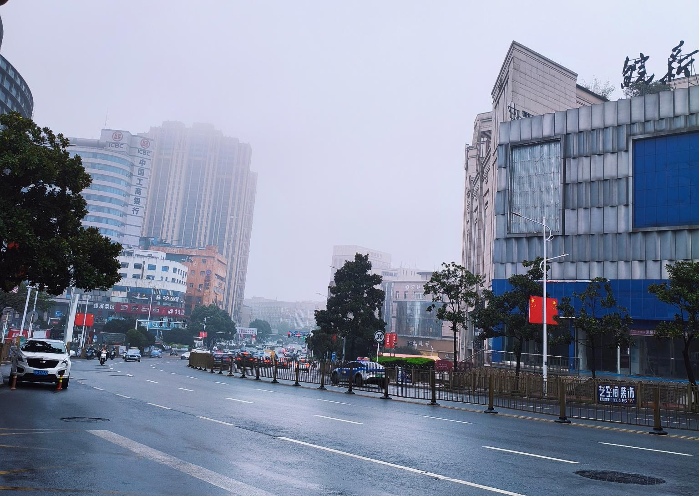
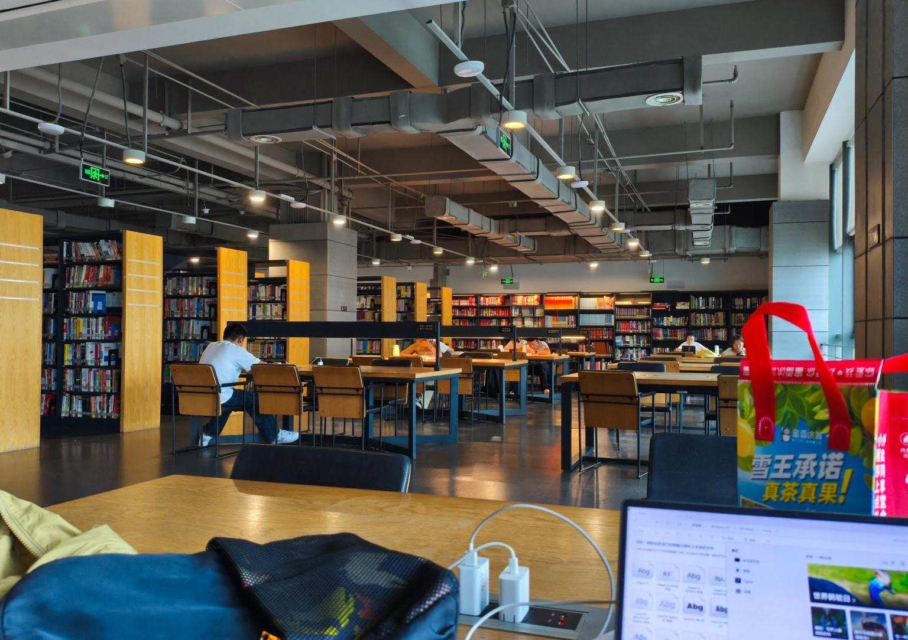
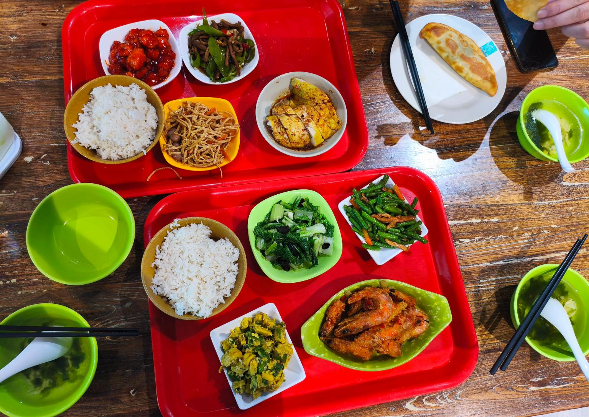
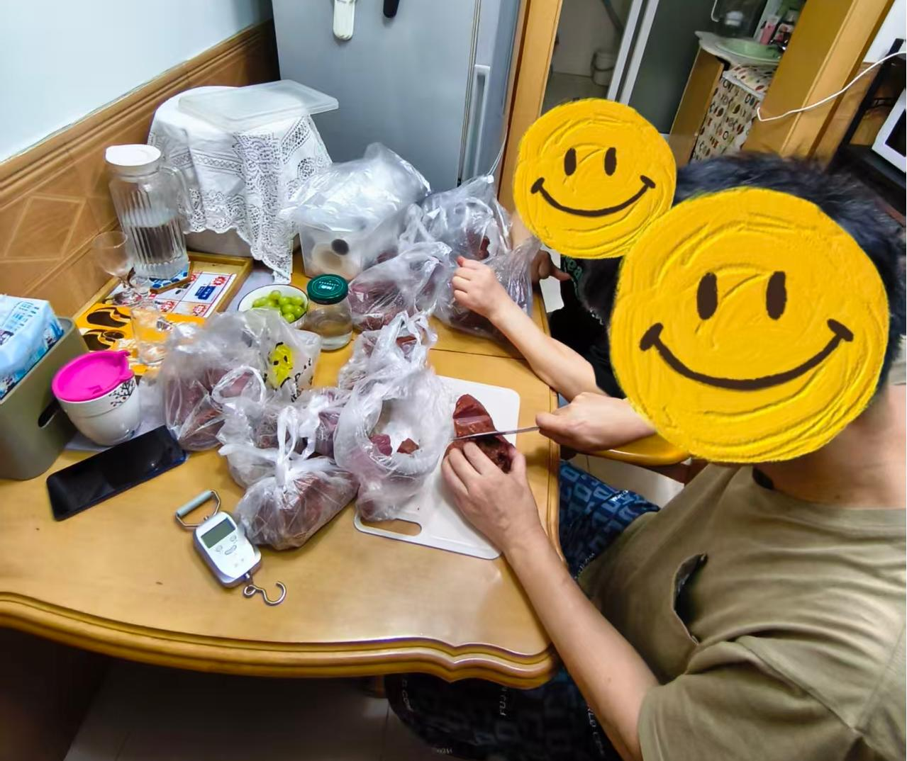
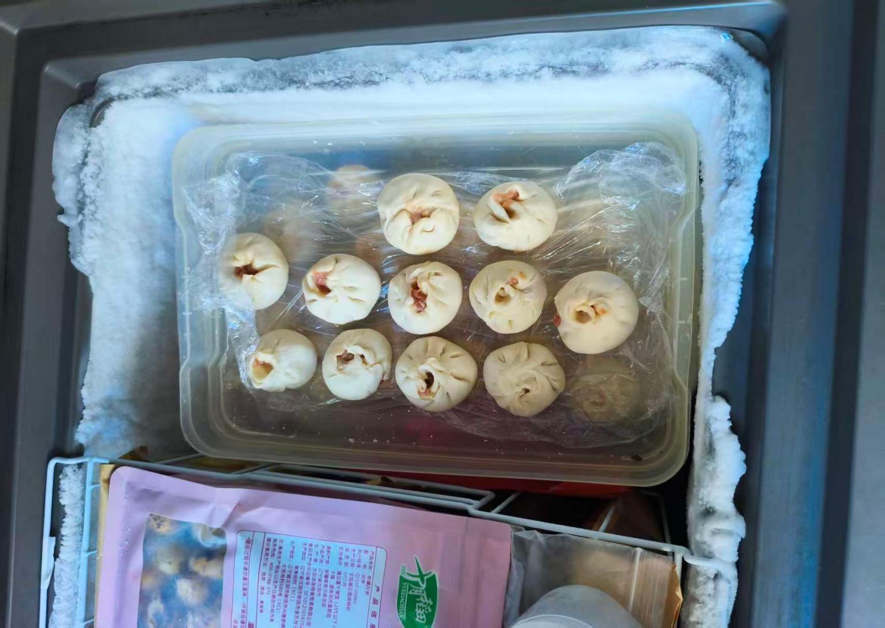

​	❤️ 一篇生活日记。❤️
​	<!-- more -->

​	昨天突然兴起，想去图书馆看看。外面天阴阴的，10点出发，坐了一个小时的公交🚌，接近中午才到。

​		周五的图书馆人不多。我去的是靠近西湖湿地那边的新图书馆，建了有十年了，但环境还是很干净。

​		学了一下午的LaTex语法，算是入了个门。安装的Tex Studio，本来编译个简单的tex文件老是报一大堆错误，搞得我很烦躁。后来发现原来是我的latex.exe的路径设置得有问题，而且系统自带的字体文件也没确认一下就直接让deepseek给我生成例子copy。看来也还是不能太相信deepseek了。🤨🤨🤨

​		

​		晚上一家人👨‍👩‍👧在草根谣大食堂吃了个美美的晚饭。菜品多又很实惠。我们三个人一共才花了50块钱。

​		吃完饭去大润发逛了逛。快到国庆了，超市人还蛮多的。之前大润发的购物卡花完了，我妈专门挑打折的菜买。超市有个大爷人很好，我问他能不能帮我把西兰花的梗子切掉点儿，他就偷偷地从口袋里面拿出把小刀给我们去掉了。

​		回家之后爸爸很开心地给我展示他在单位预订的10斤牛肉。我妈问这能吃到过年吗？我觉得够呛，我家很能吃荤菜的。

​		看看这老两口，分装牛肉的时候老快乐了😄😄😄

​		

​			我觉得今天还蛮充实的。

​			结尾再给大家展示一下我这周自己做的小笼包，皮厚了点儿，但是我这个馅料调得很好吃的。	

